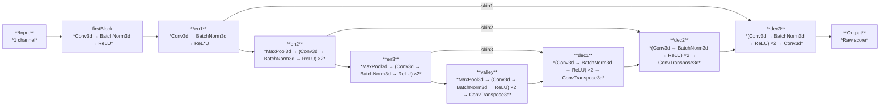

# ML4MIP: Machine Learning for Medical Image Processing

## Overview
ML4MIP is a machine learning framework designed for medical image processing tasks, including training, validation, inference, preprocessing, postprocessing, and graph extraction. It utilizes the Hydra configuration manager for flexible configuration handling.

The project focuses on employing deep learning models such as UNETR, UNet, MedSAM, and nnU-Net to segment coronary arteries in CTA images, and then extract graph-based representations of coronary structures. This effort aims to enhance the early detection of coronary artery disease (CAD), a significant global health issue, as well as the treatment planning. CAD is characterized by the narrowing of coronary vessels due to plaque buildup, leading to reduced blood flow and serious health events.

## Features
- **Training**: Train deep learning models on medical imaging datasets.
- **Validation**: Evaluate trained models using validation datasets.
- **Preprocessing**: Prepare datasets for training and inference.
- **Inference**: Run inference on new medical images.
- **Graph Extraction**: Extract graph representations from medical images.
- **Postprocessing**: Apply filtering and cleanup operations on model outputs.
- **MLFlow Integration**: Log experiments, model parameters, and metrics.

## Installation
ML4MIP uses `pyproject.toml` for dependency management. To install the project and its dependencies, follow these steps:

```bash
# Clone the repository
git clone git@github.com:pvmeng/ML4MIP.git
cd ml4mip

# Create and activate a virtual environment (optional but recommended)
python -m venv venv
source venv/bin/activate  # On Windows use `venv\Scripts\activate`

# Install the package
pip install .
```

Alternatively, if you want to install it in editable mode for development:

```bash
pip install -e .
```

## Usage
ML4MIP provides a set of command-line scripts for various tasks. You can list all available commands and their parameters using:

```bash
train --help

ml_flow_uri: file://${hydra:runtime.cwd}/runs
model_dir: ${hydra:runtime.cwd}/models
model_tag: unet.pt
batch_size: 16
lr: 0.01
num_epochs: 100
model:
  model_type: UNETMONAI2
  model_path: null
  base_model_jit_path: null
  checkpoint_path: null
dataset:
  train:
    data_dir: ${hydra:runtime.cwd}/data/rand_patch_96
    mask_dir: ${hydra:runtime.cwd}/data/rand_patch_96
    image_affix:
    - ''
    - .img.nii.gz
    mask_affix:
    - ''
    - .label.nii.gz
    transform: PATCH_POS_CENTER
    size:
    - 96
    - 96
    - 96
    train: true
    split_ratio: 0.9
    target_pixel_dim:
    - 0.35
    - 0.35
    - 0.5
    target_spatial_size:
    - 600
    - 600
    - 280
    sigma_ratio: 0.1
    pos_center_prob: 0.75
    max_samples: null
    cache: false
    cache_pooling: 0
    mask_operation: STD
    max_epochs: 40
    grouped: true
  val:
    data_dir: /data/training_data
    mask_dir: /data/training_data
    image_affix:
    - ''
    - .img.nii.gz
    mask_affix:
    - ''
    - .label.nii.gz
    transform: STD
    size:
    - 96
    - 96
    - 96
    train: true
    split_ratio: 0.9
    target_pixel_dim:
    - 0.35
    - 0.35
    - 0.5
    target_spatial_size:
    - 600
    - 600
    - 280
    sigma_ratio: 0.1
    pos_center_prob: 0.75
    max_samples: 2
    cache: false
    cache_pooling: 0
    mask_operation: STD
    max_epochs: 1
    grouped: false
visualize_model: true
visualize_model_val_batches: 1
visualize_model_train_batches: 4
plot_3d: true
extract_graph: false
epoch_profiling_torch: false
epoch_profiling_cpy: false
inference:
  mode: SLIDING_WINDOW
  sw_size:
  - 96
  - 96
  - 96
  sw_batch_size: 4
  sw_overlap: 0.25
  model_input_size:
  - 96
  - 96
  - 96
loss:
  loss_type: CE_DICE
  lambda_dice: 1.0
  lambda_ce: 0.3
  cedice_batch: false
  alpha: 0.5
scheduler:
  scheheduler_type: LINEARLR
  linear_start_factor: 1.0
  linear_end_factor: 0.01
  linear_total_iters: null
  resume_schedule: true
```

## Configuration
ML4MIP uses [Hydra](https://hydra.cc/) to manage configurations. All parameters can be modified in `conf/config.yaml`. Users can override settings directly via the command line:

```bash
train batch_size=16 lr=0.01 num_epochs=100
```

### Available Commands
```bash
train
validate
inference
preprocessing
extract_graph
postprocessing
```


For dataset settings and advanced configurations, refer to `conf/config.yaml`.

## Logging and Experiment Tracking
ML4MIP integrates with MLFlow for tracking experiments. Logs, model checkpoints, and evaluation metrics are stored under `ml_flow_uri`, which can be set in the configuration.

## Repository Structure

```bash
src/          # Main codebase for pipeline components and workflows  
experiments/  # Jupytext notebooks for various experimental analyses  

```

## U-Net architecture


